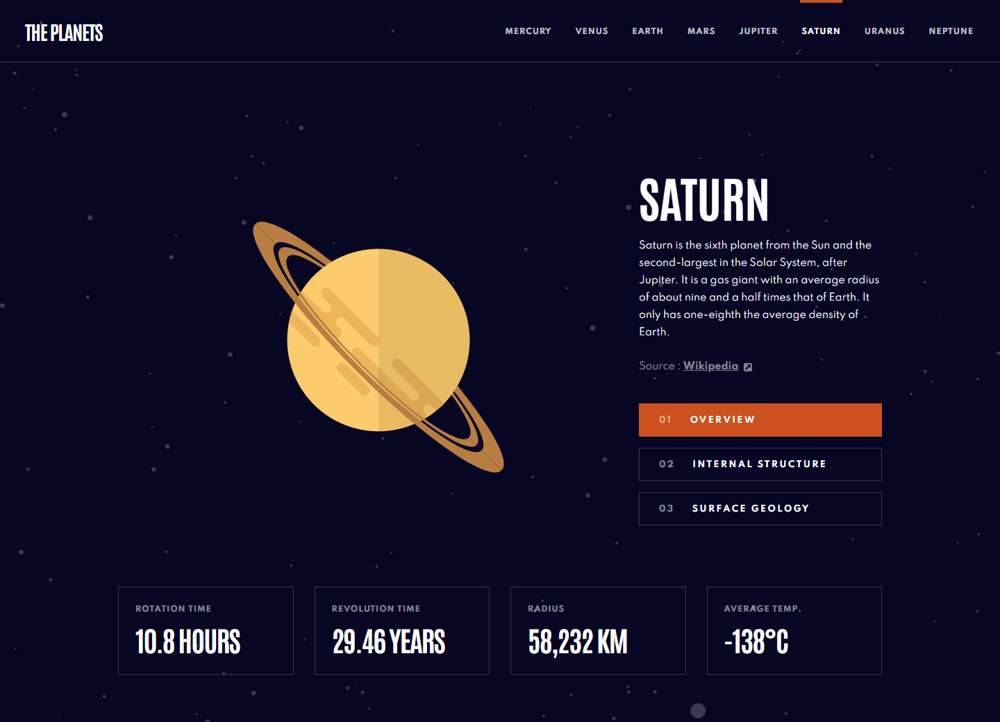
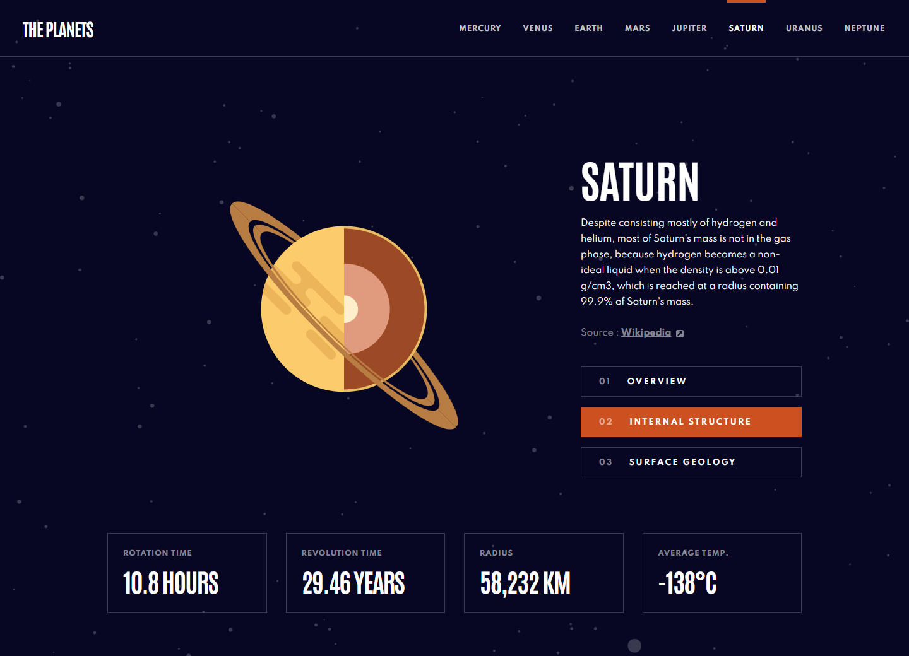
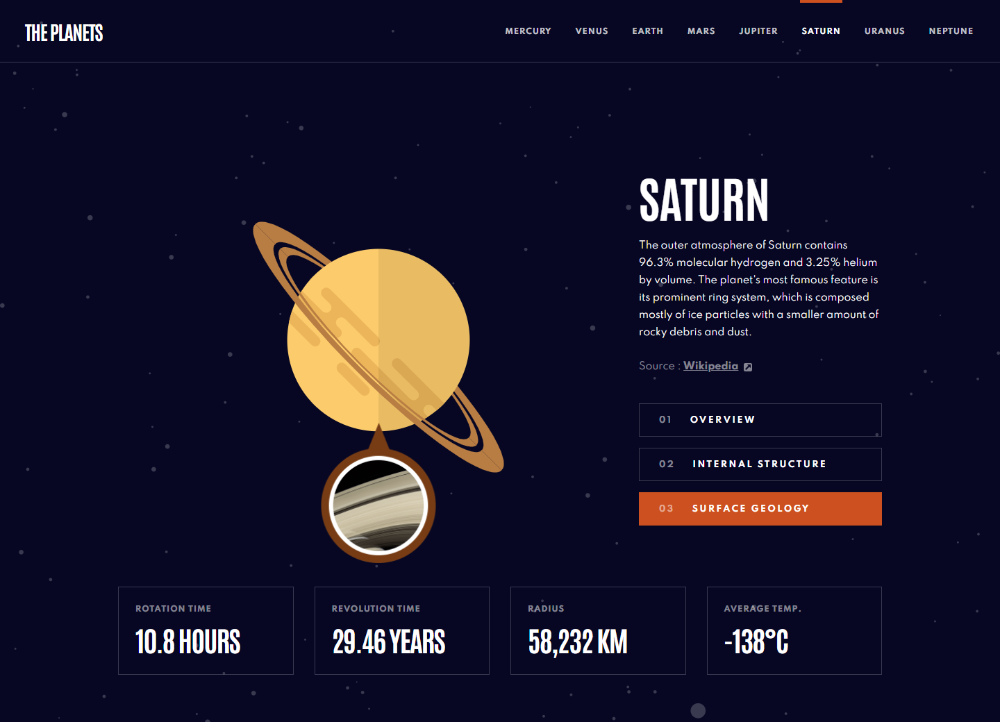
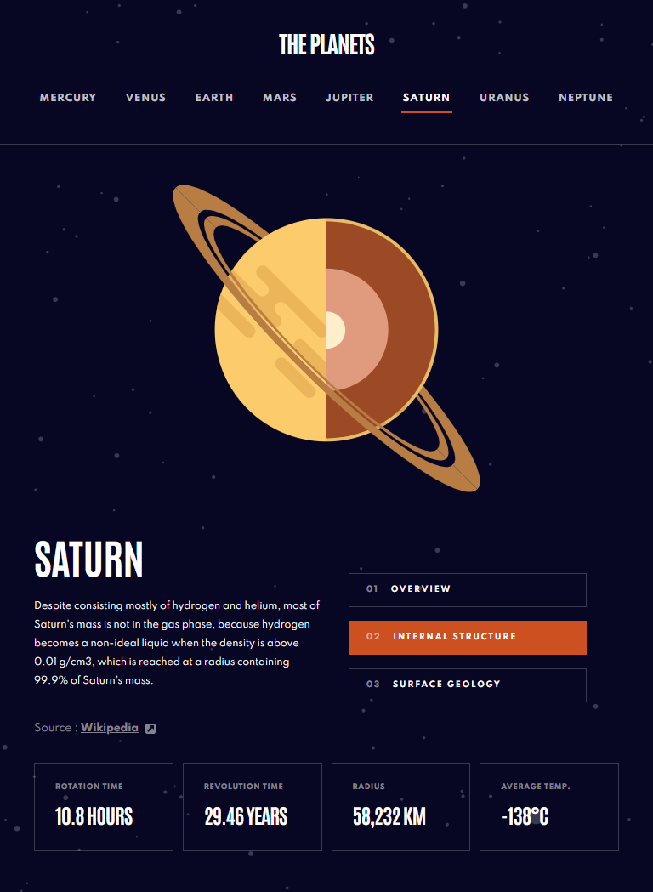
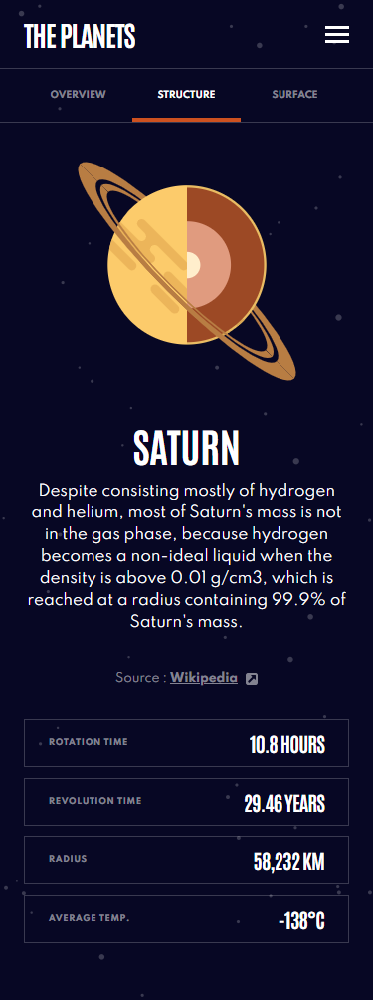

# Frontend Mentor - Planets fact site solution

This is a solution to the [Planets fact site challenge on Frontend Mentor](https://www.frontendmentor.io/challenges/planets-fact-site-gazqN8w_f). Frontend Mentor challenges help you improve your coding skills by building realistic projects.

## Table of contents

- [Overview](#overview)
  - [The challenge](#the-challenge)
  - [Screenshot](#screenshot)
  - [Links](#links)
- [My process](#my-process)
  - [Built with](#built-with)
  - [What I learned](#what-i-learned)
- [Author](#author)

## Overview

### The challenge

Users should be able to:

- View the optimal layout for the app depending on their device's screen size
- See hover states for all interactive elements on the page
- View each planet page and toggle between "Overview", "Internal Structure", and "Surface Geology"

### Screenshot

### Links

- Solution URL: (https://www.frontendmentor.io/solutions/responsive-planet-fact-site-built-with-reactreactrouter-ZNPUZ9PCj)
- Live Site URL: (https://lm-planet-fact-site.netlify.app/)

## My process

### Built with

- Semantic HTML5/JSX markup
- CSS custom properties/vars
- Desktop-first workflow
- React / React-router
- JSON data
- CSS Grid

### What I learned

I had already done dynamic pages with React in the past, but I had a break for a while, so it was nice to do it again, and it worked very well and had little issues.

One thing I definitely could improve on is adding extra data into the local JSON file. For things like the planet images max width's at smaller screens, each image had a different max width, however I only recieved assets for desktop, and the JSON file didn't specify this max width data.

I didn't improve on this because I treated it like a real API, one that I did not code and have no access to it. This did make small parts of my code not follow the DRY (Do Not Repeat Yourself) principle, but for small things.

If I could've spoken to the design team who designed this, I would probably ask for multiple versions of one image (desktop, tablet, mobile) or asked them to use some sort of % value for max widths that's uniform across all images.

## Author

- Website - [Leon Michalak](https://www.leonmichalak.dev)
- Frontend Mentor - [@NinjaInShade](https://www.frontendmentor.io/profile/NinjaInShade)
- Instagram - [@TheFrontendGuy](https://www.instagram.com/thefrontendguy/)
